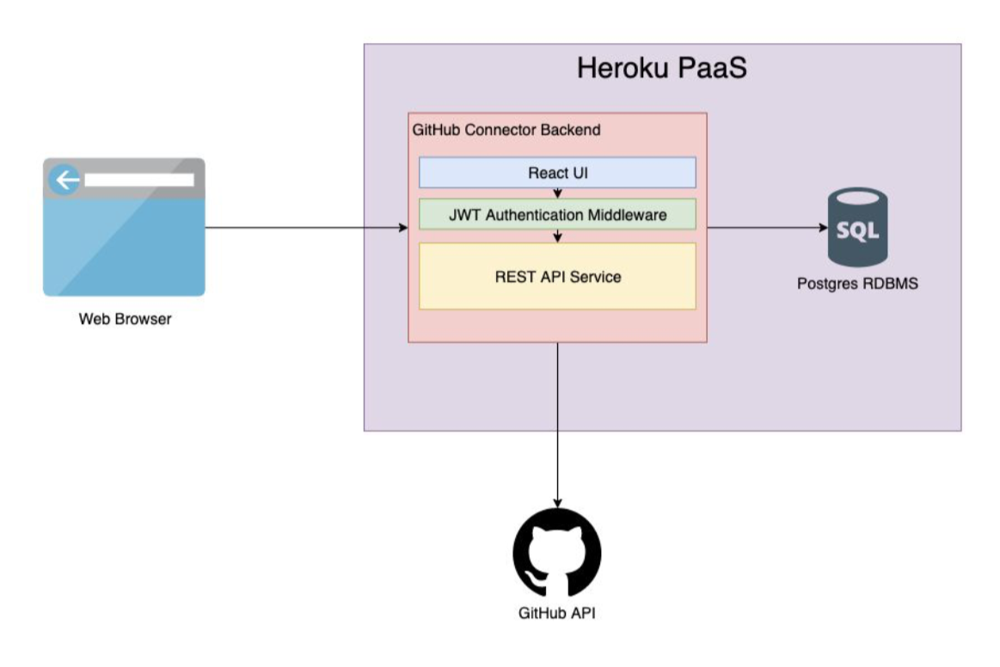
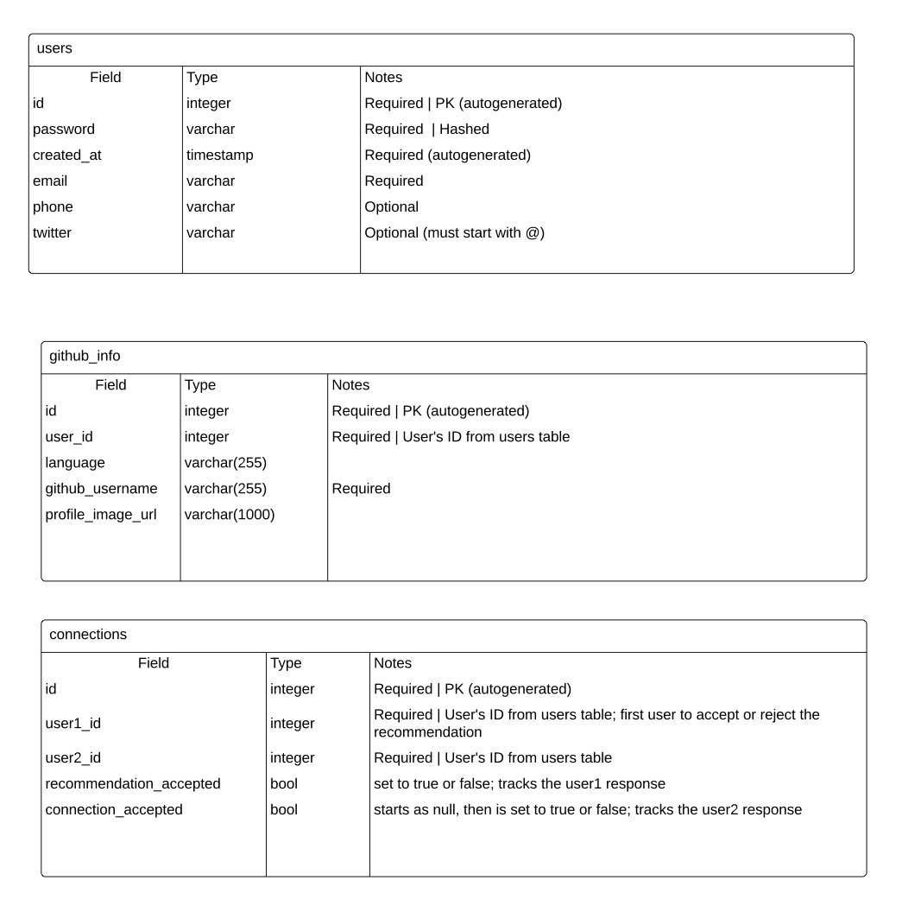
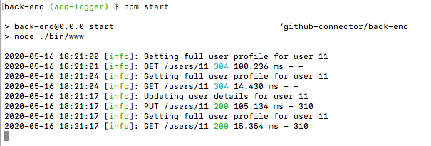

GitHub Connector

Group Eight

OSU CS361\_400\_Spring2020

# **GitHub Connector**

GitHub Connector is a social app that brings together people who use similar coding languages and frameworks by using their GitHub repositories to create connections. It allows users to:

  - Create a GitHub Connector account
  - Edit basic profile details
  - Attach a valid GitHub account
    - GitHub profile picture, username and most commonly used language will now visible on dashboard
If no GitHub account has been attached a prompt will let the user know there is more to the application if they attach an account
  - Once a GitHub account is linked, 5 other GitHub Connect users will be suggested to connect with based off of the user&#39;s most frequently-used programming language
    - Connections can be accepted or rejected
    - Connections from other users who have asked to connect with you will be prioritized in the list of suggested connections
    - Rejected connections will not be suggested again
  - Sign in and out of the application

## **How to Run as a User**

End users of the GitHub Connector app will simply create an account at the link below. After they have created an account, they can follow the prompts to attach their GitHub account via the Edit Profile Page. Once they have attached the GitHub account, they will be provided with suggested connections with whom they can connect! The user will then be able to accept or reject the suggested connections and visit the user pages of mutually connected users.

[https://githubconnector.herokuapp.com/](https://githubconnector.herokuapp.com/)

### **How to Run Code Locally for Development**

#### **How to run project with Docker**

**Docker Compose Required.** [**Please click here to see instructions on how to install Docker Desktop for your OS.**](https://docs.docker.com/compose/install/)

1. If running for the first time: Run docker-compose build
2. Run docker-compose up
3. Navigate to [http://localhost:3001/](http://localhost:3001/) on your browser after all container are started.
4. To shut down project, press Ctrl-C and docker-compose down

##### **Troubleshooting**

- command not found when running docker-compose up

Ensure the Docker Service is running.

#### **How to run project without Docker**

**PostgreSQL Required.** [**Please click here to see instructions on how to install PostgreSQL for your OS.**](https://www.postgresql.org/download/)

In the selected database for GitHub Connector, run the &#39;\&lt;date\&gt;\_create-schema.sql&#39; located in the &#39;database&#39; directory.

Start your Postgres server locally

Then set up a .env file with information about your local db, and save it to the root of the backend directory: [https://www.taniarascia.com/node-express-postgresql-heroku/#environment-variables](https://www.taniarascia.com/node-express-postgresql-heroku/#environment-variables)

To start the back-end navigate to the back-end directory and run &#39;npm install&#39; and then &#39;npm run start:dev&#39; once install is complete. This will start running the backend with nodemon.

To start the front-end navigate to the front-end directory and run &#39;npm install&#39; and then &#39;yarn start&#39; once install is complete. Once complete this will direct you to [http://localhost:3001/](http://localhost:3001/) where the application will be rendered.

Refer to READMEs in both front-end and back-end folders for more details.

## **GitHub Connector&#39;s most important quality attributes:**

Usability - As a social media application, our application wants to reach a wide range and large number of users

Reliability - To encourage wide adoption of our application, the application should be durable and consistently perform well for users.

Testing - To ensure quality, the software should be easily testable by developers. This will encourage developers to perform testing as they work.

## **Software Architecture and Design**

GitHub Connector is built with a PostgreSQL, Express, Node.js and React stack. React is the front-end UI that renders items to be seen and interacted with by the user. Express and Node.js work in tandem to be the backend framework that builds the middleware and RESTful API. The app also uses JWT authentication middleware. This is a token-based middleware that allows signed in users to only access their data, or data that is available to them. Once a user signs in, they are issued a token (that lasts for a set period of time) that is validated on API calls to ensure the particular user has rights to access the data requested.

The backend works with different API calls to make requests to the Postgres database, as well as making requests out to the GitHub API. Depending where the requests are going, it will either return stored database data or information about the requested GitHub accounts. All of the account information, account interaction information and schema are stored in the Postgres database which is accessed via the API services. Every one of these components are hosted on the Heroku platform where a deployed, fully interactive, responsive and comprehensive web app is available to the user&#39;s web browser. Below a high-level diagram of GitHub Connector&#39;s architecture:

The backend API will not be visible to the end user. It accepts and returns JSON and uses the following HTTP status codes:

- 200 response indicates success
- 400 (user-defined error; example: wrong type of input, or missing input)
- 403 (user is not authorized)
- 404 (either user does not exist, or requesting user does not have access)
- 500 response (system failure: DB connection error)

If successful, the API returns a JSON array with a single object containing the data requested. Below are two examples of these responses. The first is what is returned for a successful POST request to create a new user. Since the new user has not attached their GitHub account or added a twitter or phone, these values default to null. A JWT authentication token is also returned so that the user can continue to be verified when they use the app.

       [ {
        "id": 6,
        "github_info":  null,
        "created_at": "2020-04-13T18:17:58.443Z",
        "email": "okay@gmail.com",
        "twitter": null,
        "phone": null,
        "token": "<jwt authentication token>",
    }]

This second example is what is returned from a GET request when the correct user ID and token have been provided. This example user has a GitHub account attached, so the github\_info object is populated.

    [{
        "id": 6,
        "created_at": "2020-04-13T18:17:58.443Z",
        "email": "okay@gmail.com",
        "twitter": null,
        "phone": null,
        "github_info": {
            "id": 2,
            "user_id": 43,
            "github_username": "aUsername",
            "profile_image_url": null,
            "language": javascript
        }
}]

**Database ER Diagram**

## **Design Patterns**

**Reference to our design pattern:**

 **Singleton** - Ensure a class only has one instance and provide a global point of access to it._

A singleton instance of a logger was created and then can be globally accessed in all of the user routes. This creates a single log file that gives description to all of the GET/PUT/POST&#39;s accessed in the backend. A logger allows us to better visualize and monitor the activity of the GitHub Connector app. It can also be a very useful tool in debugging if something goes wrong to see what combinations of items lead to the issue.

Here is a screenshot of the logger being demonstrated where we can see that it shows what the backend calls are as well as the log text that describes them:

## **Current State of GitHub Connector**

At this time there are no known bugs. We have attempted to be very thorough with testing in our git staging branch before we pushed into production. Testing also helped steer our design as we looked for potential edge cases in different implementation strategies.

### **Product Backlog**

There is currently nothing left in the Product Backlog, as everything that was set out upon, in the original aggressively aimed project meeting has been completed. That does not mean that the current app couldn&#39;t be improved upon though. While working on the app we were all able to imagine some additional items that could be added to future sprints to expand functionality. A couple of additions that could be added:

- Delete previously established connections
- Detach GitHub account from user account
- Password recovery
- Messages between users
- Blog posts
- View repositories

## **File Structure**

The general file structure of the project is split into 3 parts:

- Full project with Docker enclosed database for local deployment and files for production Heroku deployment
- The &#39;back-end&#39; directory that contains all of the files that are needed to run the back end of the project (minus the Postgres database)
  - Inside the back-end directory files are split into smaller directories with all subfiles being children of the directories name (api, (database) helpers, middlewares, routes). The exception of this is the bin directory that is needed to run the backend
  - The back-end also contains app.js and config.js that run the backend and allow for connection to the database
- The &#39;front-end&#39; directory that contains all of the client frontend files
  - Inside the front-end there is a directory named public that is used for the React framework when it creates the builds of the front-end
  - The &#39;src&#39; directory contains the working files for the front-end &#39;api&#39;, &#39;helpers&#39; and &#39;shared&#39; all contain respective pieces of the project that have been abstracted for greater clarity and ease of use, while &#39;components&#39; contains all distinct page details.
  - The other .js files in the front-end are for the React framework to be built for development and production

It should be noted that the Docker file is not used when deployed on Heroku. This is only for containerizing it locally. Heroku has its own attached/integrated Postgres database

## **Future Contributions**

This CODEOWNERS file is included in the root of the project GitHub directory to allow people access and understanding:

    The project is open and able to be contributed by anyone who would like to make
    additions to GitHub Connector. The original five of OSU CS361\_400\_Spring2020 
    Group Eight are the owners. These owners will be the default owners for 
    everything in the repo. Unless a later match takes precedence, these owners
    will be requested for review when someone opens a pull request:
    
    @jonabantao @AndreEPaul @Jedeu @PaulNewling @mcmoonstruck

The project contains a git staging branch which all new pull requests will be merged and tested locally before they are pushed to the master branch. This is to ensure that multiple pull requests in quick succession can all be tested together to ensure functionality. Remember, testing is one of this project&#39;s main quality attributes. The master branch is what is deployed to Heroku. The five code owners above all have the ability to deploy to deploy the app to Heroku.